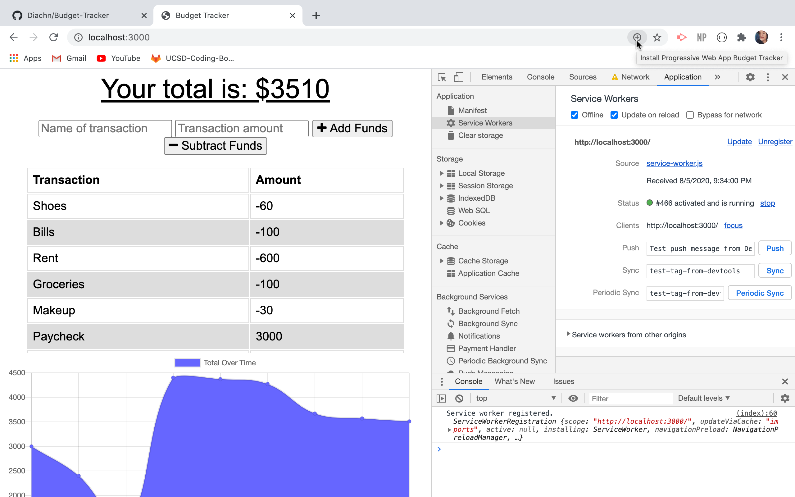

# Budget Tracker (PWA)

## Description

Budget Tracker is a progressive web application that allows users to track their budgets by adding expenses and deposits to their budget through the "Add/Subtract Funds" buttons. They are able to add a transaction with or without a connection. When a user enters a transaction while offline, these transactions are stored in the indexedDB, and transferred to the database when the user comes back online.

## Usage
To install the required dependencies, run `npm install` in your terminal.
To start the server, run `npm start`. To access the app after starting the server, go to http://localhost:3000 in your browser.

Deployed App: https://lit-ridge-53204.herokuapp.com/

